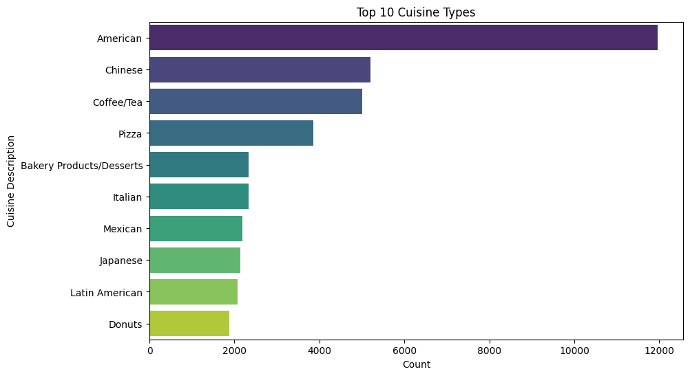

## 1. Title and Author

- **Project Title:** **InspectionGuard** - Predictive Analytics for Food Safety
- Prepared for UMBC Data Science Master Degree Capstone by Dr Chaojie (Jay) Wang
- **Author Name:** Abhishek Goud Thamatam
- **Semester** - Fall 2023
-  
- 
-   
- Link to your YouTube video - In progress
    
## 2. Background

Using data science and machine learning, predictive modeling for health inspections helps predict which restaurants might fail health inspections done by local health departments. It uses past inspection info, restaurant details, and more to find places that might have food safety issues. By doing so, it aims to assist health departments in allocating their inspection resources more effectively and improving public health by reducing foodborne illnesses.

Food safety is a critical public health concern, and restaurants play a significant role in ensuring the safety of the food they serve to the public. The usual health inspections take a lot of time and might not happen often enough to stop problems. Predictive modeling for health inspections is important for a few reasons:

  *Resource Allocation:* It helps health departments decide which places to inspect more often based on how risky they are. Risky places get checked more, and safer ones get checked less. This way, resources are used well.

  *Early Intervention:* By identifying establishments with a higher likelihood of violations, health departments can step in early to help them follow the rules and keep food safe.

  *Public Health:* Doing inspections this way can lead to a reduction in foodborne illnesses and related hospitalizations, ultimately improving public health outcomes.
  
### Research questions

- Analysis:
  
 What key factors influence the likelihood of a restaurant failing an inspection?

- ML:

How can predictive modeling be used to allocate inspection resources more efficiently? For example, can we prioritize inspections for high-risk establishments while reducing the frequency of inspections for low-risk ones?   

## 3. Data 

- **Data sources:** NYC OpenData [Dataset link](https://data.cityofnewyork.us/Health/DOHMH-New-York-City-Restaurant-Inspection-Results/43nn-pn8j)
- **Data size:** 92 MB
- **Data shape:** # of rows - 205K and # columns - 27
- **Time period:** 2014 - 2023
- **Each row represent** - Inspection values(Restaurant Citations)
- **Data dictionary:**
  
| Column Name           | Description                                                   | Type             |
| ----------------------| ------------------------------------------------------------- | ----------------- |
| CAMIS                 | Unique identifier for the restaurant                          | Plain Text       |
| DBA                   | Name of the restaurant                                        | Plain Text       |
| BORO                  | Borough in which the entity (restaurant) is located.;• 1 = MANHATTAN • 2 = BRONX • 3 = BROOKLYN • 4 = QUEENS • 5 = STATEN ISLAND • Missing;                        | Plain Text       |
| BUILDING              | Building number for the restaurant location                   | Plain Text       |
| STREET                | Street name for the restaurant location                       | Plain Text       |
| ZIPCODE               | Zip code of the restaurant location                            | Plain Text       |
| PHONE                 | Phone number provided by the restaurant owner/manager         | Plain Text       |
| CUISINE DESCRIPTION   | Description of the restaurant's cuisine                        | Plain Text       |
| INSPECTION DATE       | This field represents the date of inspection; NOTE: Inspection dates of 1/1/1900 mean an establishment has not yet had an inspection                                            | Date & Time      |
| ACTION                | Actions associated with each restaurant inspection             | Plain Text       |
| VIOLATION CODE        | Violation code associated with an inspection                    | Plain Text       |
| VIOLATION DESCRIPTION | Description of the violation                                    | Plain Text       |
| CRITICAL FLAG         | Indicator of the critical violation; "• Critical • Not Critical • Not Applicable"; Critical violations are those most likely to contribute to food-borne illness                               | Plain Text       |
| SCORE                 | Total score for a particular inspection                        | Number           |
| GRADE                 | Grade associated with the inspection; • N = Not Yet Graded• A = Grade A• B = Grade B• C = Grade C• Z = Grade Pending• P= Grade Pending issued on re-opening following an initial inspection that resulted in a closure                          | Plain Text       |
| GRADE DATE            | Date when the current grade was issued                         | Date & Time      |
| RECORD DATE           | Date when the extract was produced                             | Date & Time      |
| INSPECTION TYPE       | A combination of the inspection program and the type of inspection performed; See Data Dictionary for full list of expected values   | Plain Text       |
| Latitude              | Latitude coordinate of the location                            | Number           |
| Longitude             | Longitude coordinate of the location                           | Number           |
| Community Board       | Community board information                                    | Plain Text       |
| Council District      | Council district information                                   | Plain Text       |
| Census Tract          | Census tract information                                       | Plain Text       |
| BIN                   | BIN (Building Identification Number)                           | Plain Text       |
| BBL                   | BBL (Borough, Block, and Lot) information                      | Plain Text       |
| NTA                   | NTA (Neighborhood Tabulation Area) information                  | Plain Text       |
| Location Point1       | Location Point1 information                                    | Point            |

*Potential values:*

1. BORO (Borough):

    1 = MANHATTAN
 
    2 = BRONX
 
    3 = BROOKLYN
 
    4 = QUEENS
 
    5 = STATEN ISLAND
 

2. ACTION (Actions associated with inspections):

    Violations were cited in the following area(s).
   
    No violations were recorded at the time of this inspection.
   
    Establishment re-opened by DOHMH
   
    Establishment re-closed by DOHMH
   
    Establishment Closed by DOHMH. Violations were cited in the following area(s) and those requiring immediate action were addressed.
   
    "Missing" = Not yet inspected.

4. CRITICAL FLAG (Indicator of critical violation):

    Critical
   
    Not Critical
   
    Not Applicable

6. GRADE (Grade associated with the inspection):

    N = Not Yet Graded
   
    A = Grade A
   
    B = Grade B
   
    C = Grade C
   
    Z = Grade Pending
   
    P = Grade Pending issued on re-opening following an initial inspection that resulted in a closure

8. INSPECTION TYPE (Combination of inspection program and type):

    Various types of inspection programs and types. Specific values may vary.

**Target variable:**

CRITICAL FLAG (Classification Problem)

**Potential Features:**

I have to do more research on Potential Features too. Few possibilities: CUISINE DESCRIPTION, BORO, ZIPCODE, VIOLATION CODE, Scores.

## 4. Exploratory Data Analysis (EDA)

In this report, I will perform data exploration using the Jupyter Notebook to prepare data for predictive modeling in the field of health inspection resource allocation. The primary goals of this EDA are to gain insights into the dataset, identify potential issues, and ensure that the data is well-prepared for machine learning. EDA is a crucial initial step in the data science workflow as it helps in understanding the data, identifying potential issues, and preparing the dataset for predictive modeling.

### Summary Statistics

To understand the central tendencies and distributions of key variables, we will produce summary statistics. This will provide a quick overview of the data's numerical characteristics.

|index|CAMIS|ZIPCODE|SCORE|Latitude|Longitude|Community Board|Council District|Census Tract|BIN|BBL|Location Point1|Zip Codes|Community Districts|Borough Boundaries|City Council Districts|Police Precincts|
|---|---|---|---|---|---|---|---|---|---|---|---|---|---|---|---|---|
|count|204779\.0|202065\.0|195292\.0|204521\.0|204521\.0|201528\.0|201524\.0|201524\.0|200511\.0|204236\.0|0\.0|0\.0|0\.0|0\.0|0\.0|0\.0|
|mean|47501541\.44339019|10707\.780372652363|22\.56001269893288|40\.18764349800532|-72\.9619926917571|254\.3530824500814|20\.8012594033465|30121\.92546793434|2572959\.1717860866|2460530335\.0888925|NaN|NaN|NaN|NaN|NaN|NaN|
|std|4051338\.676293571|594\.1668956080247|17\.42482680570349|4\.655750489806165|8\.452103609005125|129\.8922178957821|15\.793059468100164|31585\.262773793642|1343615\.846794968|1335404678\.9575863|NaN|NaN|NaN|NaN|NaN|NaN|
|min|30075445\.0|8512\.0|0\.0|0\.0|-74\.249101331725|101\.0|1\.0|100\.0|1000000\.0|1\.0|NaN|NaN|NaN|NaN|NaN|NaN|
|25%|41639626\.0|10023\.0|11\.0|40\.682963614771|-73\.988819791819|106\.0|4\.0|8000\.0|1051401\.0|1011137502\.0|NaN|NaN|NaN|NaN|NaN|NaN|
|50%|50064472\.0|11101\.0|18\.0|40\.730345398397|-73\.956204843605|302\.0|20\.0|17700\.0|3020902\.0|3007780010\.0|NaN|NaN|NaN|NaN|NaN|NaN|
|75%|50105567\.0|11231\.0|30\.0|40\.761156327016|-73\.896037248187|401\.0|34\.0|42600\.0|4005905\.0|4004337501\.0|NaN|NaN|NaN|NaN|NaN|NaN|
|max|50141665\.0|12345\.0|168\.0|40\.912822326386|0\.0|595\.0|51\.0|162100\.0|5799501\.0|5270000501\.0|NaN|NaN|NaN|NaN|NaN|NaN|

### Data Cleansing

#### Data Selection and Focus

My analysis will focus on the target variable and selected features. All other columns will be dropped to streamline the dataset for predictive modeling. I dropped these columns based on domain knowledge, understanding of data, and No values in some columns.

'BUILDING',' STREET', 'PHONE',' Community Board', 'VIOLATION CODE', 'CAMIS', 'DBA',' VIOLATION DESCRIPTION',' INSPECTION TYPE',' GRADE DATE',	'RECORD DATE',' Council District', 'Census Tract', 'BIN', 'BBL', 'NTA', 'Location Point1', 'Zip Codes', 'Community Districts', 'Borough Boundaries', 'City Council Districts',' Police Precincts'
#### Missing Values

Checking for null values, I found the following number of null cells:
|Column|No. of Null cells|
|---|---|
|BORO|0|
|ZIPCODE|2714|
|CUISINE DESCRIPTION|2319|
|INSPECTION DATE|0|
|ACTION|2319|
|CRITICAL FLAG|0|
|SCORE|9487|
|GRADE|103307|
|Latitude|258|
|Longitude|258|

I dropped all rows with null values as I can't give mean etc to replace null.

#### Duplicate Rows

Duplicate rows can distort my analysis, so I will identify and remove any duplicate entries. I have found '93540' rows with duplicate data and dropped them.

After clearing rows with null values and duplicate rows, the number of columns was reduced from 204779 to 64658

### Data Transformation

Depending on my analysis goals, I performed data filtering, Mapping, and Extracting to structure the data more suitably. These transformations will be based on the specific requirements of our predictive modeling task.

Filtering: Filtered all rows with 'Not Applicable' values as this is my target variable, I must have an output value.

Mapping: Converted all Yes/No and types of violations into numeric to make it easier.

Extraction: Extracted Month and Year from Inspection date, as features available are not highly correlated, I want to extract this as the process of Feature engineering.

### Data Analysis and Visualizations

I created visualizations using Plotly Express, a powerful Python library for interactive data visualization. These visualizations will help me gain a better understanding of the dataset and its characteristics.

1. Time Series Analysis: Since we have an 'INSPECTION DATE' column, we can perform a time series analysis to explore trends and patterns over time

The score has increased over the years.

The score is neither increasing nor decreasing continuously over the months. But we can see the peak and deep points in the month of August and May respectively.

2. Distribution of Inspection Scores: This histogram will give you an overview of how inspection scores are distributed. Visualize the distribution of numerical variables and identify any outliers.

Scores 12 and 13 are the most repeated among all scores

3. Count of Inspections by Borough: This bar chart shows the number of inspections in each borough.

The number of inspections happening in Manhattan is high compared to the rest Boroughs. Followed by Brooklyn, Queens, and Bronx. The lowest number of inspections happen in Staten Island(which is almost 1/10th of Manhattan). 

4. The mean score is approximately the same in each borough.

5. Critical vs. Non-Critical Violations: This pie chart displays the proportion of critical and non-critical violations in your dataset.

We have an almost equal number of critical and noncritical violation data in our cleaned data set.

6. 

When we count cuisine types, the number of American cuisines is much higher with almost 12k, followed by Chinese, Coffee/Tea, and pizza. The next 6 cuisines are varied by a small margin around 2k.

## 5. Model Training

In this phase, diverse machine learning models are employed to harness predictive analytics for the InspectionGuard project. The selected models include the Random Forest Classifier, Logistic Regression, DecisionTreeClassifier, and XGBClassifier.

### Model Training Approach:

#### Train vs Test Split:

Splitting the dataset into training and testing sets is essential for model evaluation. I will use an 80/20 split, allocating 80% of the data for training and 20% for testing.

#### Tools and Packages:

**Python Packages:** I will leverage the scikit-learn library for its comprehensive set of tools for machine learning. Utilizing scikit-learn ensures ease of implementation and compatibility with various machine learning algorithms.

**Development Environment:** Google Colab is our development environment of choice, providing a collaborative and cloud-based platform for efficient model training. Colab offers GPU acceleration, facilitating faster model training.

#### Model Performance Evaluation:

To assess and compare the performance of our models, I will employ various metrics such as accuracy, precision, recall, and F1-score. The `classification_report` function from scikit-learn will provide a comprehensive overview of the model's performance, including precision, recall, and F1-score for each class. The accuracy score will serve as a fundamental metric, representing the overall correctness of the model predictions.

### Models Used:

#### Random Forest Classifier:

**Strengths:** Robust handling of complex relationships in data, solid baseline performance.

**Considerations:** Moderate accuracy compared to other models.

Performance of random forest:

#### Logistic Regression:

**Strengths:** Simplicity and efficiency in binary classification, excellent accuracy.

**Considerations:** May not capture complex relationships.

Performance of Logistic Regression:

#### Decision Tree Classifier:

**Strengths:** Interpretable and visually clear decision-making, identifies important features.

**Considerations:** Lower accuracy compared to other models.

Performance of Decision Tree Classifier:

#### XGB Classifier:

**Strengths:** Ensemble learning for efficiency, balances bias-variance trade-off.

**Considerations:** Moderate accuracy, falls between Random Forest and Logistic Regression.

Performance of XGB Classifier:

